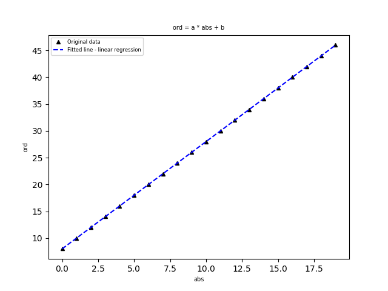
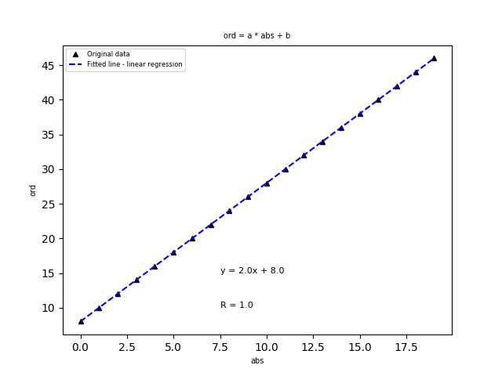

# Koala

Pandas pour les SVT

## Installation

    git clone https://github.com/YannBouyeron/koala
    
    cd koala
    
    sudo python setup.py install
    
## Exemple 1:

    >>> import pandas as pd
    >>> import numpy as np
    >>> from koala import Koala
    
    >>> x = np.arange(20)
    >>> y = 2 * x + 8

    >>> x
    array([ 0,  1,  2,  3,  4,  5,  6,  7,  8,  9, 10, 11, 12, 13, 14, 15, 16,
    17, 18, 19])
    
    >>> y
    array([ 8, 10, 12, 14, 16, 18, 20, 22, 24, 26, 28, 30, 32, 34, 36, 38, 40,
    42, 44, 46])

    >>> kf = Koala({"abs":x, "ord":y})
    >>>
    >>> kf.head()
       abs  ord
    0    0    8
    1    1   10
    2    2   12
    3    3   14
    4    4   16

    >>> lin = kf.lin("abs", "ord")
    

  

    
    
    >>> lin
    AttrDict({'a': 1.9999999999999998, 'b': 8.000000000000002, 'r': 1.0, 'equation': 'y = 2.0x + 8.0', 'graph': <module 'matplotlib.pyplot' from '/usr/local/lib/python3.6/site-packages/matplotlib/pyplot.py'>})
    >>>
    >>> lin.a
    1.9999999999999998
    >>> lin.b
    8.000000000000002
    >>> lin.r
    1.0
    >>> lin.equation
    'y = 2.0x + 8.0'

    >>> plt = lin.graph
    
    >>> plt.text(7.5, 15, lin.equation, fontsize=8)
    Text(7.5,15,'y = 2.0x + 8.0')
    
    >>> plt.text(7.5, 10, "R = " + str(lin.r), fontsize=8)
    Text(7.5,10,'R = 1.0')
    
    >>> plt.show()

  

    >>> plt.savefig("linplot.png")

